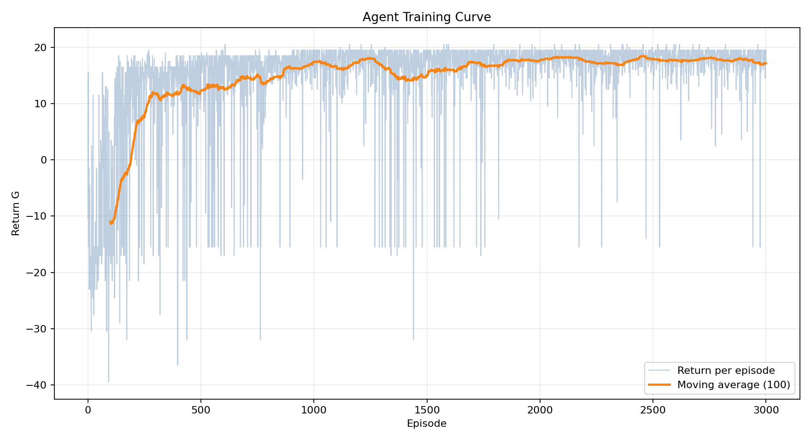
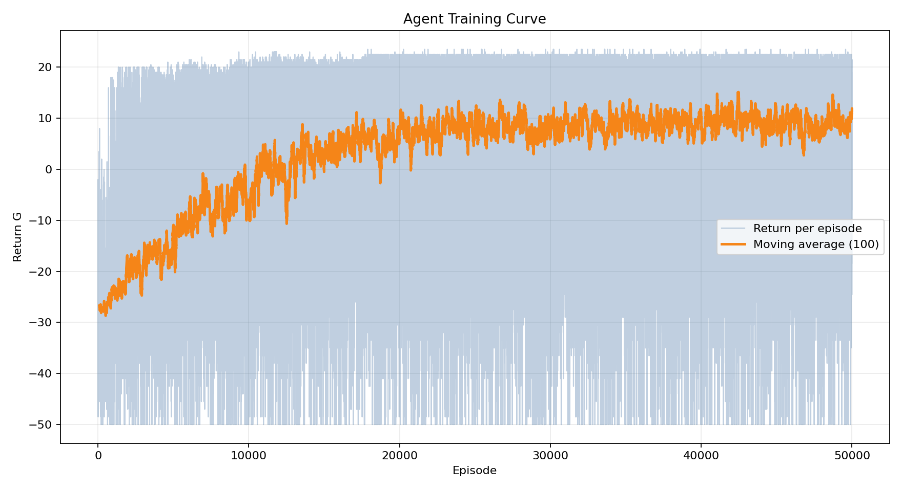

# Evolution of Agent Training (REINFORCE)

## 0) Task overview
- An agent moves in a 2D grid with obstacles.
- 4 actions: **Left, Up, Right, Down**.
- Goal: cover as many reachable cells as possible and finish episodes before the step limit.

---

## 1) Where I started

### 1.1 State
- The environment state included:
  - current position `(x, y)`,
  - neighbors in fixed order: `current, left, up, right, down`,
  - per-neighbor flags: `is_obstacle`, `is_visited`,
  - step counter `steps`.

### 1.2 Actions
- At each step, the agent picked one of 4 actions.
- If an action led into an obstacle/outside boundary, the agent stayed in place.

### 1.3 First reward scheme
- `REWARD_NEW = 1.0` for entering a new cell.
- `REWARD_VISITED = -0.5` penalty for revisiting.

---

---

## 2) REINFORCE policy

### 2.1 What changed in policy
- **Parameterized policy**:
  - trainable `theta` (action logits).
- Action probabilities via **softmax(logits)**.
- Invalid actions are masked out.

### 3.2 What changed in trajectory collection
- Stored full episode trajectory: `state, action, probs, reward`.
- At episode end, computed return `G` and called `reinforce_update(...)`.

---

## 3) What exactly was being learned
- Learned **policy parameters** (logits/θ) that define action distribution.
- Used episodic REINFORCE objective:
$$
G(\tau)\cdot \sum_t \nabla \log \pi(a_t \mid s_t)
$$

$$
J(\theta)=\mathbb{E}_{\tau\sim\pi_\theta}[G(\tau)],\qquad
G(\tau)=\sum_{t=0}^{T-1}\gamma^t r_t
$$

$$
\nabla_\theta J(\theta)=
\mathbb{E}_{\tau\sim\pi_\theta}
\left[
G(\tau)\sum_{t=0}^{T-1}\nabla_\theta\log\pi_\theta(a_t\mid s_t)
\right]
$$

$$
\pi_\theta(a=i\mid s)=
\frac{\exp(\theta_i(s))}
{\sum_{j=1}^{4}\exp(\theta_j(s))}
$$

$$
\pi_\theta(a=i\mid s)=
\frac{m_i(s)\exp(\theta_i(s))}
{\sum_{j=1}^{4}m_j(s)\exp(\theta_j(s))}
\quad\text{(with action mask)}
$$

$$
\nabla_{\theta(s_t)}\log\pi_\theta(a_t\mid s_t)
= y_t-\pi_\theta(\cdot\mid s_t)
$$

$$
\theta\leftarrow\theta+\alpha g,\qquad
 g=
\frac1N\sum_{k=1}^N
G(\tau^{(k)})
\sum_t\nabla_\theta\log\pi_\theta(a_t^{(k)}\mid s_t^{(k)})
$$

---

## 4) Why context had to be included
Problem: keying only by `(x,y)` did not distinguish the same position under different local conditions.
This caused conflicting updates and local loops.

### Context features added
- Added local context to policy key:
  - **valid_bits** for 4 directions,
  - compact neighbor visitedness features.
- Idea: policy should encode both “where I am” and “what surrounds me now”.

---

## 5) Extra stabilizations added
- Added a **baseline** to reduce gradient variance.
- Clipping for updates/logits (to avoid premature policy collapse).
- Exploration control (epsilon).

## Baseline used in REINFORCE

To reduce gradient variance, I used a **scalar baseline** equal to the **mean episodic return in the current batch**:

$$
b \;=\; \frac{1}{N}\sum_{k=1}^{N} G(\tau^{(k)}),
$$
where:
- $N$ is the number of sampled episodes before one update,
- $G(\tau^{(k)})$ is the total discounted return of episode $k$.

Then each episode is weighted by the centered return (advantage-like term):
$$
A^{(k)} \;=\; G(\tau^{(k)}) - b.
$$

So the policy-gradient estimator becomes:
$$
\hat g \;=\; \frac{1}{N}\sum_{k=1}^{N}
\left(G(\tau^{(k)})-b\right)
\sum_{t=0}^{T_k-1}\nabla_\theta \log \pi_\theta(a_t^{(k)}\mid s_t^{(k)}).
$$

And the update is gradient ascent:
$$
\theta \leftarrow \theta + \alpha \hat g.
$$

### Why this baseline
- It does **not** depend on the sampled action \(a_t\), so the estimator remains unbiased.
- It significantly reduces variance compared to using raw \(G(\tau)\) only.
- It is simple and works well for episodic REINFORCE without adding a value-network.

---

## 6) Final variant: what is considered
In the final policy decision I use:
1. Current agent position.
2. Validity of 4 directions (wall/boundary or not).
3. Local neighbor visitedness (context).
4. Policy probabilities from trainable logits.
5. Reward signal:
   - positive for new cells,
   - penalty for revisits

---

## 7) Final result
- Agent performance is clearly better than the initial random baseline.
- More completed episodes and better coverage.
- Main takeaway: in this task, performance depends not only on REINFORCE, but on **state design + reward shaping + stabilization**.

### Return per episode without obstacles

### Return per episode with obstacles

