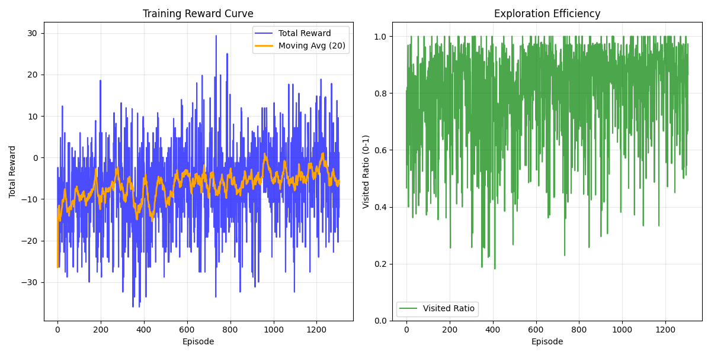

# PROJECT DESCRIPTION

## 1. Задача идеологически
**Цель**: Создать агента (робот-пылесос), способного эффективно обойти всю доступную площадь (пол) в неизвестном помещении.
- Агент должен посетить каждую клетку типа `FLOOR` хотя бы один раз.
- Минимизировать количество шагов и повторных посещений.
- Избегать столкновений со стенами (`WALL`) и препятствиями (`OBSTACLE`).

## 2. State, action, reward (Старая логика)

### 2.1 State
- The environment state included:
  - current position `(x, y)`,
  - neighbors in fixed order: `current, left, up, right, down`,
  - per-neighbor flags: `is_obstacle`, `is_visited`,
  - step counter `steps`.

### 2.2 Actions
- At each step, the agent picked one of 4 actions.
- If an action led into an obstacle/outside boundary, the agent stayed in place.

### 2.3 First reward scheme
- `REWARD_NEW` for entering a new cell.
- `REWARD_VISITED` penalty for revisiting.

## 3. Policy, baseline (Старая логика)

### 3.1 REINFORCE policy
- **Parameterized policy**:
  - trainable `theta` (action logits).
- Action probabilities via **softmax(logits)**.
- Invalid actions are masked out.

### 3.2 What changed in trajectory collection
- Stored full episode trajectory: `state, action, probs, reward`.
- At episode end, computed return `G` and called `reinforce_update(...)`.

---

## 3.3 What exactly was being learned
- Learned **policy parameters** (logits/θ) that define action distribution.
- Used episodic REINFORCE objective:
$$
J(\theta) = \mathbb{E}_{\tau \sim \pi_\theta} [G(\tau)]
$$
- **Формула обновления весов (Gradient Ascent)**:
$$
\theta \leftarrow \theta + \alpha \sum_{t=0}^{T-1} \nabla_\theta \log \pi_\theta(a_t \mid s_t) \cdot (G_t - b)
$$
где:
- $\alpha$ — скорость обучения (learning rate).
- $G_t$ — дисконтированная награда (return) от шага $t$.
- $b$ — baseline (среднее значение $G_t$ по батчу) для уменьшения дисперсии.

---

## 4. Смена State и генерации поля (Новая логика)

### 4.1 State (Текущая реализация)
Вместо локальных признаков, теперь используется **глобальное представление** карты.
Вектор состояния (State Vector) формируется путем выравнивания (flattening) нескольких карт:
1. **Explored Floor Map**: Бинарная карта открытых клеток пола (где был агент или видел их).
2. **Explored Wall Map**: Бинарная карта обнаруженных стен.
3. **Visited Map** (Новое!): Бинарная карта посещенных клеток (история траектории).
4. **Current Position**: One-hot карта текущего положения агента.
5. **Local View**: 8 локальных признаков (is_floor, is_visited для 4 соседей).

Размерность входа для MLP: $4 \times (Rows \times Cols) + 8$.

### 4.2 Генерация поля (Room Generation)
Используется процедурная генерация (`build_random_room`) с проверкой связности (`is_floor_connected`):
1. **Инициализация**: Пустая комната со стенами по периметру.
2. **Добавление препятствий**:
   - **Circles**: Круглые препятствия случайного радиуса.
   - **Gaussians**: "Мягкие" препятствия через пороговую функцию Гаусса.
   - **Lines**: Линейные стены.
3. **Контроль связности**: После генерации проверяется, доступен ли каждый участок пола из любой точки (граф связен).
   - Если граф несвязен (есть изолированные зоны), генерация повторяется с уменьшенным коэффициентом препятствий (`ratio *= 0.85`).

---

## 5. MLP (Multi-Layer Perceptron) Архитектура

### 5.1 Архитектура
Простая полносвязная сеть:
1. **Input**: Вектор размерности $N_{obs} = 4HW + 8$.
2. **Hidden Layer 1**: Linear($N_{obs} \to 128$) + ReLU.
3. **Hidden Layer 2**: Linear($128 \to 128$) + ReLU.
4. **Output Layer**: Linear($128 \to 4$) — логиты для 4 действий (UP, DOWN, RIGHT, LEFT).

### 5.2 Обучение
Используется тот же алгоритм REINFORCE.
- **Masking**: Логиты действий, ведущих в стены, принудительно устанавливаются в $-\infty$ ($-1e9$), чтобы `softmax` давал им 0 вероятность.

---

## 6. CNN (Convolutional Neural Network) Архитектура

### 6.1 Архитектура
Для работы с пространственной структурой (grid) используется сверточная сеть.
**Input**: Тензор размера $(B, 6, H, W)$. Каналы:
1. Explored Floor
2. Explored Wall
3. Visited Map
4. Current Position
5. **CoordConv X**: Канал с координатой X (нормализованный 0..1).
6. **CoordConv Y**: Канал с координатой Y.

**Структура**:
1. **Spatial Branch** (Пространственная ветвь):
   - 3 слоя `Conv2d` (3x3, stride=1, padding=1) + BatchNorm + ReLU.
   - Каналы: $6 \to 32 \to 64 \to 64$.
   - Сохраняет размерность карты $(H, W)$.
   - Выход расщепляется на:
     - **Flatten + Linear**: Проекция признаков карты (256 dim).
     - **Global Avg Hook**: Глобальный контекст (64 dim).
2. **Local Branch**:
   - Обработка 8 локальных признаков через `Linear` слой (32 dim).
3. **Fusion**:
   - Конкатенация всех ветвей: $256 + 64 + 32 = 352$ признака.
4. **Head**:
   - `Linear(352 \to Hidden) \to ReLU \to Linear(Hidden \to 4)`.

### 6.2 Обучение
Аналогично REINFORCE, но с добавлением **Input Regularization** на веса первого сверточного слоя (`conv1.weight`) для предотвращения переобучения на шумных входных данных.

---

  - (-) Требует миллионов шагов для обучения.
  - (-) Может застревать в локальных минимумах.

## 7. Сравнение с эвристикой DFS

### 7.1 Алгоритм Greedy DFS
Реализован жадный алгоритм поиска в глубину с возвратом (Backtracking):
1. Агент держит в памяти стек пути `stack` и множество посещенных клеток `visited`.
2. На каждом шаге:
   - Если у текущей клетки есть **непосещенные** соседи-не-стены:
     - Выбирается случайный из них.
     - Текущая позиция добавляется в `stack`.
     - Агент переходит в новую клетку.
   - Если все соседи посещены (тупик):
     - Агент извлекает предыдущую позицию из `stack` (pop).
     - Делает шаг назад в эту позицию.

### 7.2 Сравнение
- **DFS**:
  - (+) Гарантирует покрытие всей области (если связна).
  - (+) Не требует обучения.
  - (-) Требует идеальной памяти (стек) и знания графа переходов (backtracking).
- **RL (CNN/MLP)**:
  - (+) Учится обобщать стратегию поиска.
  - (+) Может работать с частичной наблюдаемостью (в перспективе).
  - (-) Требует миллионов шагов для обучения.
  - (-) Может застревать в локальных минимумах.

### Сравнение DFS и CNN

