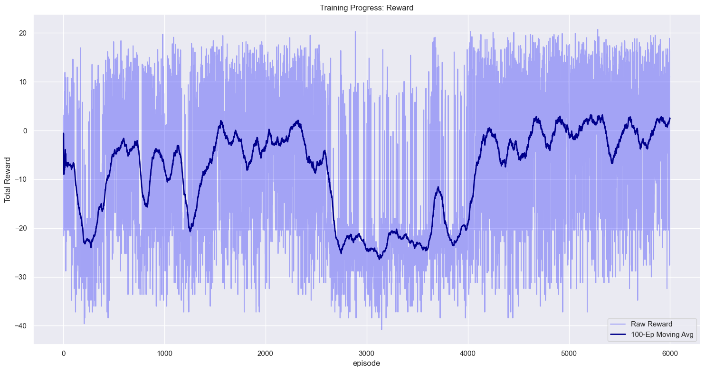
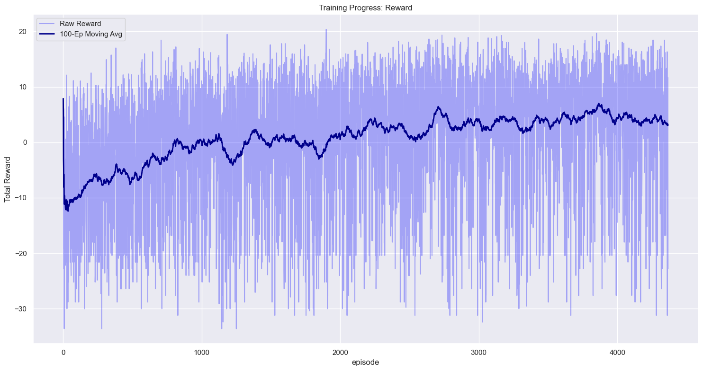
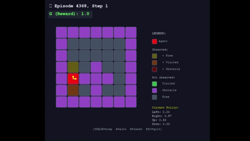
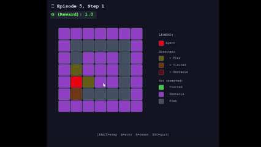
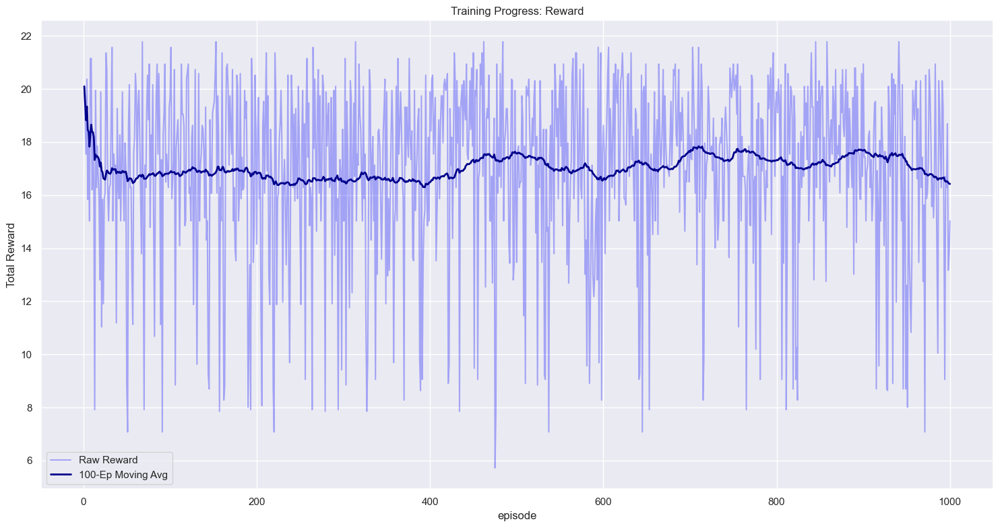

# Evolution of Agent Training (REINFORCE)

## 1. Task Overview
- An agent moves in a 2D grid with obstacles.
- 4 actions: **Left, Up, Right, Down**.
- Goal: cover as many reachable cells as possible and finish episodes before the step limit.

---

## 2. Where We Started

### 2.1 State
- The environment state included:
  - current position `(x, y)`,
  - neighbors in fixed order: `current, left, up, right, down`,
  - per-neighbor flags: `is_obstacle`, `is_visited`,
  - step counter `steps`.

### 2.2 Actions
- At each step, the agent picked one of 4 actions.
- If an action led into an obstacle/outside boundary, the agent stayed in place.

### 2.3 First Reward Scheme
- `REWARD_NEW = 1.0` for entering a new cell.
- `REWARD_VISITED = -0.5` penalty for revisiting.

---

## 3. REINFORCE Policy

### 3.1 What Changed in Policy
- **Parameterized policy**:
  - trainable `theta` (action logits).
- Action probabilities via **softmax(logits)**.
- Invalid actions are masked out.

### 3.2 What Changed in Trajectory Collection
- Stored full episode trajectory: `state, action, probs, reward`.
- At episode end, computed return `G` and called `reinforce_update(...)`.

---

## 4. What Exactly Was Being Learned
- Learned **policy parameters** (logits/θ) that define action distribution.
- Used episodic REINFORCE objective:

$$G(\tau)\cdot \sum_t \nabla \log \pi(a_t \mid s_t)$$

$$J(\theta)=\mathbb{E}_{\tau\sim\pi_\theta}[G(\tau)],\qquad G(\tau)=\sum_{t=0}^{T-1}\gamma^t r_t$$

$$\nabla_\theta J(\theta)= \mathbb{E}_{\tau\sim\pi_\theta} \left[ G(\tau)\sum_{t=0}^{T-1}\nabla_\theta\log\pi_\theta(a_t\mid s_t) \right]$$

$$\pi_\theta(a=i\mid s)= \frac{\exp(\theta_i(s))}{\sum_{j=1}^{4}\exp(\theta_j(s))}$$

$$\pi_\theta(a=i\mid s)= \frac{m_i(s)\exp(\theta_i(s))}{\sum_{j=1}^{4}m_j(s)\exp(\theta_j(s))} \quad\text{(with action mask)}$$

$$\nabla_{\theta(s_t)}\log\pi_\theta(a_t\mid s_t) = y_t-\pi_\theta(\cdot\mid s_t)$$

$$\theta\leftarrow\theta+\alpha g,\qquad g= \frac1N\sum_{k=1}^N G(\tau^{(k)}) \sum_t\nabla_\theta\log\pi_\theta(a_t^{(k)}\mid s_t^{(k)})$$

---

## 5. Why Context Had to Be Included
Problem: keying only by `(x,y)` did not distinguish the same position under different local conditions.
This caused conflicting updates and local loops.

### 5.1 Context Features Added
- Added local context to policy key:
  - **valid_bits** for 4 directions,
  - compact neighbor visitedness features.
- Idea: policy should encode both "where the agent is" and "what surrounds it now".

---

## 6. Extra Stabilizations Added
- Added a **baseline** to reduce gradient variance.
- Clipping for updates/logits (to avoid premature policy collapse).
- Exploration control (epsilon).

### 6.1 Baseline Used in REINFORCE

To reduce gradient variance, we used a **scalar baseline** equal to the **mean episodic return in the current batch**:

$$b \;=\; \frac{1}{N}\sum_{k=1}^{N} G(\tau^{(k)}),$$

where:
- \\(N\\) is the number of sampled episodes before one update,
- \\(G(\tau^{(k)})\\) is the total discounted return of episode \\(k\\).

Then each episode is weighted by the centered return (advantage-like term):

$$A^{(k)} \;=\; G(\tau^{(k)}) - b.$$

So the policy-gradient estimator becomes:

$$\hat g \;=\; \frac{1}{N}\sum_{k=1}^{N} \left(G(\tau^{(k)})-b\right) \sum_{t=0}^{T_k-1}\nabla_\theta \log \pi_\theta(a_t^{(k)}\mid s_t^{(k)}).$$

And the update is gradient ascent:

$$\theta \leftarrow \theta + \alpha \hat g.$$

### 6.2 Why This Baseline
- It does **not** depend on the sampled action \\(a_t\\), so the estimator remains unbiased.
- It significantly reduces variance compared to using raw \\(G(\tau)\\) only.
- It is simple and works well for episodic REINFORCE without adding a value-network.

---

## 7. Final Variant: What Is Considered
In the final policy decision we use:
1. Current agent position.
2. Validity of 4 directions (wall/boundary or not).
3. Local neighbor visitedness (context).
4. Policy probabilities from trainable logits.
5. Reward signal:
   - positive for new cells,
   - penalty for revisits.

---

## 8. Final Result
- Agent performance is clearly better than the initial random baseline.
- More completed episodes and better coverage.
- Main takeaway: in this task, performance depends not only on REINFORCE, but on **state design + reward shaping + stabilization**.

### Return per Episode Without Obstacles

### Return per Episode With Obstacles

---

## 9. State Change and Room Generation (New Logic)

### 9.1 State (Current Implementation)
Instead of local features, a **global map representation** is now used.
The State Vector is formed by flattening multiple maps:
1. **Explored Floor Map**: Binary map of discovered floor cells (where the agent has been or has seen).
2. **Explored Wall Map**: Binary map of discovered walls.
3. **Visited Map** (New!): Binary map of visited cells (trajectory history).
4. **Current Position**: One-hot map of the agent's current position.
5. **Local View**: 8 local features (is_floor, is_visited for 4 neighbors).

Input dimension for MLP: \\(4 \times (Rows \times Cols) + 8\\).

### 9.2 Room Generation
Procedural generation (`build_random_room`) with connectivity check (`is_floor_connected`) is used:
1. **Initialization**: Empty room with walls on the perimeter.
2. **Adding Obstacles**:
   - **Circles**: Circular obstacles of random radius.
   - **Gaussians**: "Soft" obstacles via a Gaussian threshold function.
   - **Lines**: Linear walls.
3. **Connectivity Control**: After generation, checks if every floor section is accessible from any point (graph is connected).
   - If the graph is disconnected (isolated zones exist), generation repeats with a reduced obstacle ratio (`ratio *= 0.85`).

---

## 10. MLP (Multi-Layer Perceptron) Architecture

### 10.1 Architecture
Simple fully connected network:
1. **Input**: Vector of dimension \\(N_{obs} = 4HW + 8\\).
2. **Hidden Layer 1**: Linear(\\(N_{obs} \to 128\\)) + ReLU.
3. **Hidden Layer 2**: Linear(\\(128 \to 128\\)) + ReLU.
4. **Output Layer**: Linear(\\(128 \to 4\\)) — logits for 4 actions (UP, DOWN, RIGHT, LEFT).

### 10.2 Training
Uses the same REINFORCE algorithm.
- **Masking**: Logits of actions leading into walls are forcibly set to \\(-\infty\\) (\\(-1e9\\)) so that `softmax` gives them 0 probability.

### 10.3 Results

---

## 11. CNN (Convolutional Neural Network) Architecture

### 11.1 Architecture
A convolutional network is used to handle spatial structure (grid).
**Input**: Tensor of size \\((B, 6, H, W)\\). Channels:
1. Explored Floor
2. Explored Wall
3. Visited Map
4. Current Position
5. **CoordConv X**: Channel with X coordinate (normalized 0..1).
6. **CoordConv Y**: Channel with Y coordinate.

**Structure**:
1. **Spatial Branch**:
   - 3 layers `Conv2d` (3×3, stride=1, padding=1) + BatchNorm + ReLU.
   - Channels: \\(6 \to 32 \to 64 \to 64\\).
   - Preserves map dimensions \\((H, W)\\).
   - Output splits into:
     - **Flatten + Linear**: Projection of map features (256 dim).
     - **Global Avg Pool**: Global context (64 dim).
2. **Local Branch**:
   - Processing of 8 local features via a `Linear` layer (32 dim).
3. **Fusion**:
   - Concatenation of all branches: \\(256 + 64 + 32 = 352\\) features.
4. **Head**:
   - `Linear(352 → Hidden) → ReLU → Linear(Hidden → 4)`.

### 11.2 Training
Similar to REINFORCE, but with added **Input Regularization** on the weights of the first convolutional layer (`conv1.weight`) to prevent overfitting on noisy input data.

---

## 12. Comparison with DFS Heuristic

### 12.1 Greedy DFS Algorithm
A greedy depth-first search algorithm with backtracking is implemented:
1. The agent maintains a path stack `stack` and a set of visited cells `visited`.
2. At each step:
   - If the current cell has **unvisited** non-wall neighbors:
     - Choose a random one.
     - Add current position to `stack`.
     - Agent moves to the new cell.
   - If all neighbors are visited (dead end):
     - Agent pops the previous position from `stack`.
     - Steps back to that position.

### 12.2 Comparison: DFS vs CNN vs MLP vs Classic REINFORCE

**HEURISTIC**

**CNN**

**MLP**

**Classic REINFORCE** (note: 50 000 steps were made)

